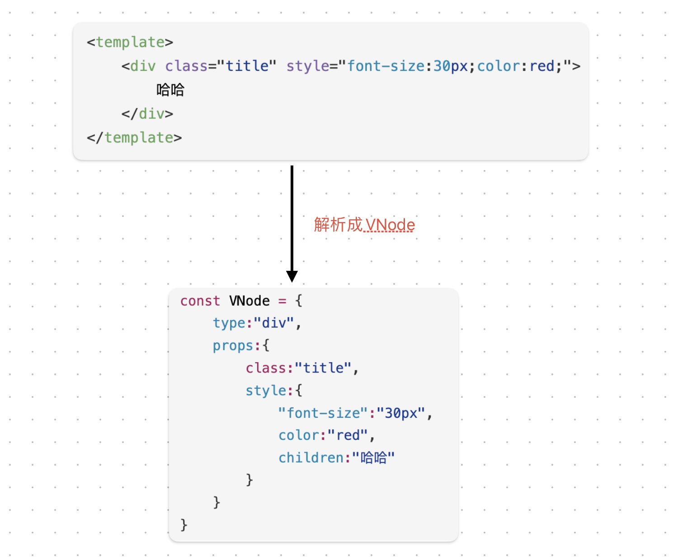
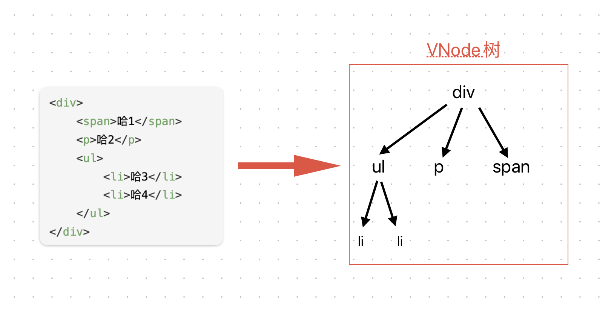
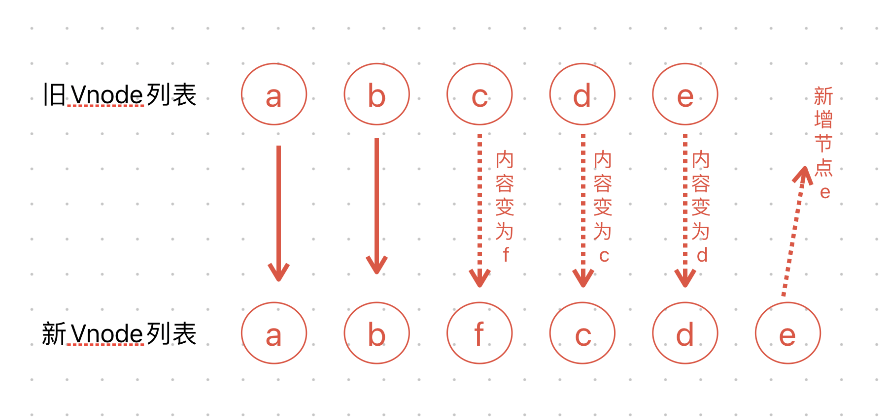
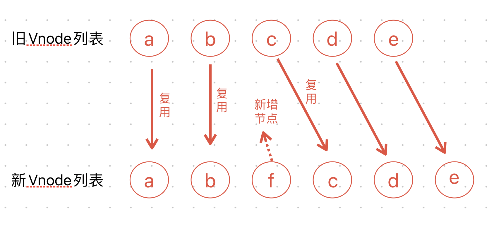

# 模版语法2--列表渲染
## v-for基本使用
### 遍历数组
``` html
<div v-for="(item,index)in arr">{{index}}--{{item}}</div>
<!-- item为数组元素项，index为数组索引 -->
```
### 遍历对象
**一个参数** “value in object”  
**两个参数** “(value,key) in  object”  
**三个参数** “(value,key,index) in  object”  
``` html
<script>
    const object = {name:"哈哈",age:12}
</script>
<div v-for="(value,key,index) in  object">
    {{value}}--{{key}}--{{index}}
</div>
```
渲染为：  
“哈哈--name--0”  
“12--age--1”  
> 也可以使用of作为分隔符来代替in，这更接近js的迭代器语法  
> \<div v-for="(value,key,index) of  object"\>  
> {{value}}--{{key}}--{{index}}  
> \</div\>
## 数组变化侦测
vue能够侦听响应式数组的变更方法，并在它们被调用时触发相关的更新，这些变更方法包括：
**push( )**&nbsp; &nbsp; **unshift( )**&nbsp; &nbsp;**reverse( )**&nbsp; &nbsp;**pop( )**
**splice( )**&nbsp; &nbsp; **shift( )**&nbsp; &nbsp; **sort( )**  
以上方法均修改原数组  
如果使用的方法不能触发视图更新(返回一个新数组)，我们需要将旧的数组替换为新的  
``` JavaScript
this.arr = this.arr.map((item)=>{return item+'why'})
```
## v-for中的key
### 什么是VNode？
VNode就是虚拟节点，无论是组件还是元素，在vue中表现出来的都是一个个VNode  
VNode本质是一个JS对象  
Vue中处理是将template中元素变成一个VNode再转换成真实的DOM元素

### 什么是虚拟DOM？
当元素嵌套后，会形成一个VNode树

而这个VNode树就叫做虚拟DOM
### Vue中列表更新的具体操作
vue事实上会对于有key和没有key的，调用两个不同的方法  
有key的会使用源码中的patchKeyedChildren方法  
没有key的会使用源码中的patchUnKeyedChildren方法  
``` html
<div id="app">
    <button @click="insertF">插入F节点</button>
    <ul>
        <li v-for="item in lists" :key="item">
            {{item}}
        </li>
    </ul>
</div>
<script>
    const app = Vue.createApp({
        data(){
            return {
                lists:['a','b','c','d','e']
            }
        },
        methods:{
            insertF(){
                this.lists.splice(2,0,'f')
            }
        }
    }).mount('#app')
</script>
```
没有key时，diff算法的操作

有key时，diff算法的操作
