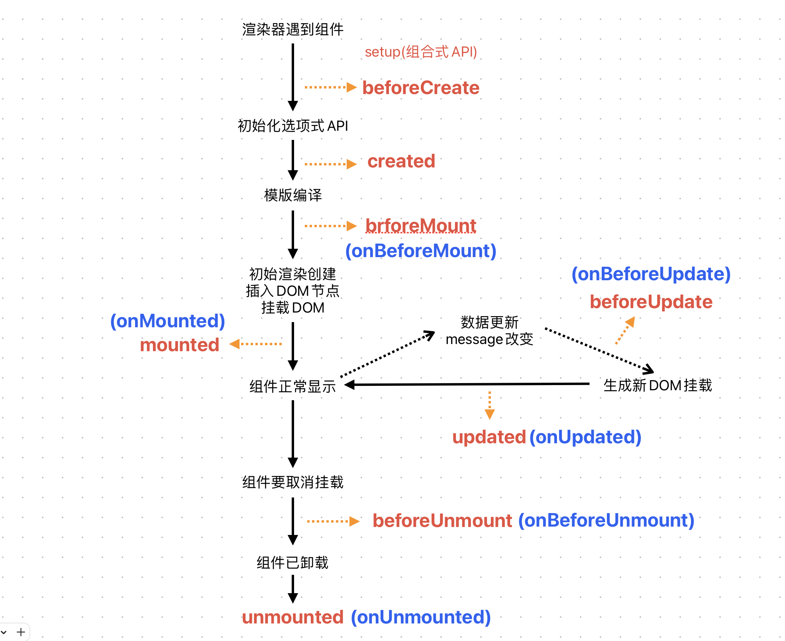

# 组合式API--setup
## OptionsAPI的弊端
OptionAPI的特点是在对应属性中编写对应的功能模块  
这样会有个弊端:  
实现某一个功能时，这个功能对应的代码逻辑会被拆分到各个属性中，  
当组件变更大更复杂时，逻辑关注点的代码会变长，  
同一个功能的逻辑会被拆分的很分散，对初次阅读和后续维护造成了一定困难。  
## 认识CompositionAPI
为了使用CompositionAPI，需要有一个可以实际使用它的地方  
在vue组件中，这个位置就是setup函数  
setup其实就是组件的另外一个选项，但我们可以用它来替代之前所编写的大部分其他选项，如：methods，computed，watch，data，生命周期钩子等  
## setup函数参数
主要有两个参数  
第一个参数：props  
第二个参数：context  
``` js
export default {
    props:{
        title: String
    },
    setup(props,context){
        console.log(props.title)
        context.emit('btnClick',{ type: "测试" })
        // 等同于this.$emit('btnClick',{ type: "测试" })
    }
}
```
### 第一个参数：props
就是父组件传递过来的属性会被放到props对象中，我们在setup中如果需要使用，那么就可以直接通过props参数获取  
* 对于定义props类型，如同vue2中使用一样，在props选项中定义  
* 在template中依然同之前一样，可以直接使用props中的属性  
* 在setup函数中想要使用props，不可以通过this去获取  
* 因为props被直接作为参数传入setup函数中，所以可以直接通过参数来使用  
### 第二个参数：context
context是一个对象，其中包含三个属性  
* attrs：所有的非props的attribute  
* slots：父组件传递过来的插槽  
* emit：当组件内部发出事件时会用到emit(因为不能使用this，所以用不了this.$emit)
## setup函数的返回值
setup的返回值可以在模版template里使用  
也就是说我们可以通过setup的返回值来替代data选项  
甚至可以返回一个执行函数来代替methods中定义的方法  
``` vue
<template>
    <div>
        <h1>当前计数：{{count}}</h1>
        <button @click="increment">+1</button>
        <button @click="decrement">-1</button>
    </div>
</template>
<script>
export default {
    setup(){
        let count = 100
        // 定义count的内容，默认定义的数据都不是响应式数据
        const increment = ()=>{
            count++
        }
        const decrement = ()=>{
            count--
        }
        return {
            count,
            increment,
            decrement
        }
    }
}
</script>
```
## setup中的生命周期钩子

|  选项式API   | setup生命周期钩子  |  描述  |
|  ----  | ----  | ----  |
| beforeCreate  | x | x |
| created  | x | x |
| beforeMount  | onBeforeMount | 在组件挂载之前调用 |
| mounted  | onMounted | 在组件挂载完成后调用 |
| beforeUpdate  | onBeforeUpdate | 数据更新前调用 |
| updated  | onUpdated | 数据更新之后调用 |
| beforeUnmount  | onBeforeUnmount | 组件实例卸载前调用 |
| unmounted  | onUnmounted | 组件实例卸载后调用 |
| activated  | onActivated | \<keepAlive\>被插入到DOM中时调用 |
| deactivated  | onDeactivated | \<keepAlive\>被移除时调用 |

## setup语法糖
\<script setup\>是在单文件组件(SFC)中使用组合式API的编译时语法糖  
当同时使用SFC与组合式API时则推荐使用该语法糖  
``` vue
<script setup>
const message = "HelloWorld"
function changeMessage(){
    message = "Hello"
}
</script>
```
里面的代码会被编译成组件setup函数内容，\<script setup\>中的代码会在每次组件实例被创建的时候执行  
### 顶层的绑定会被暴露给模版  
当使用\<script setup\>的时候，任何在\<script setup\>声明的顶层绑定(包括变量，函数声明，以及import导入的内容)都能在模板中直接使用  
```vue
<template>
    <div>
        <h2>message:{{ message }}</h2>
        <button @clicl="btnClick">点击按钮</button>
        <show-info></show-info>
    </div>
</template>
<script setup>
    import { ref } from "vue";
    import showInfo from "../pages/showInfo.vue";
    const message = ref("HelloWorld")
    function btnClick(){
        console.log("btnClick")
    }
</script>
```

### defineProps()
setup语法糖中定义prpps
```vue
<template>
    <div>
        在showInfo组件中
        {{name}}-{{age}}
    </div>
</template>
<script setup>
    const props = defineProps({
        name:{
            type: String,
            default: ""
        },
        age:{
            type:Number,
            default: 10
        }
    })
</script>
```

### defineEmits()
setup语法糖中定义emit事件
```vue
<script setup>
    const emits = defineEmits(['btnClick'])
    emits("btnClick",{value:"测试"})
</script>
```

### defineExpose()
使用\<script setup\>的组件是默认关闭的  
通过模板ref或$parent获取到的组件的公开实例，不会暴露任何在\<script setup\>中声明的绑定  
所以需要子组件通过defineExpose()去暴露property  
```js
// showInfo组件内
function foo (){
    console.log("foo")
}
defineExpose({ foo })

// 父组件中
const showInfoRef = ref(null)
showInfoRef.value.foo()
```