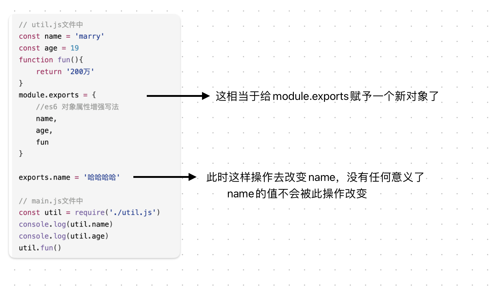

# JavaScript模块开发

## 什么是模块化？
模块化开发的目的是将程序划分成一个个小的结构
在结构中编写属于自己逻辑的代码，有自己的作用域，定义的变量不会影响其他的结构
这个结构可以暴露出自己希望暴露的变量，对象，函数等
也可以通过某种方式导入其他结构中的变量，对象，函数等

## CommonJS规范
> 注意:浏览器对于CommonJS是没有实现的，是node中对CommonJS进行了支持和实现的

### 基本用法
每个js文件都是一个单独模块，CommonJS规范的核心变量包括：**exports**，**module.exports**，**require**

**require**函数可以导入其他模块中的内容
``` JavaScript
// util.js文件中
const name = 'marry'
const age = 19
function fun(){
    return '200万'
}
exports.name = name
exports.age = age
exports.fun = fun

// main.js文件中
const util = require('./util.js')
console.log(util.name)
console.log(util.age)
util.fun()
```
### exports与module.exports
了解exports与module.exports的关系，需要明白node导出的本质是什么，见图

### module.exports

在开发中并不常见直接使用exports.name这种直接导出变量的写法
开发中常见用法：module.exports 如下：
``` JavaScript
// util.js文件中
const name = 'marry'
const age = 19
function fun(){
    return '200万'
}
module.exports = {
    //es6 对象属性增强写法
    name,
    age,
    fun
}
// main.js文件中
const util = require('./util.js')
console.log(util.name)
console.log(util.age)
util.fun()
```

## ES Module规范
### ES Module导入和导出
> 注意:采用ES Module将自动采用严格模式：use strict

关键字使用export和import来实现模块化  
export负责将模块内的内容导出  
import负责从其他模块导入内容  
如何让一个js文件成为一个单独的模块？
``` javascript
// index.html引用JS文件，每个js文件都为一个单独的模块
<script src="./util.js" type="module"></script>
<script src="./main.js" type="module"></script>
```

### export 关键字

#### 方式一：将标识符放到export后面的{}中

``` javascript
// util.js文件中导出
const name = 'why'
const age = 18
function sayHello(){
return 'sayHello'
}
export {
name,
age,
sayHello
}
// 注意：这不是对象字面量写法，{}也不是一个对象

// main.js文件中导入
import { name,age,sayHello } from './util.js'
```

#### 方式二：导出给标识符起一个别名

``` javascript
// util.js文件中导出
const name = 'why'
const age = 18
function sayHello(){
return 'sayHello'
}
export { name as fname,age,sayHello}

// main.js文件中导入
import { fname,age,sayHello } from './util.js'
```

#### 方式三：语句声明的时候直接导出

``` javascript
// util.js文件中导出
export const name = 'why'
export const age = 18
export function sayHello(){
return 'sayHello'
}

// main.js文件中导入
import { fname,age,sayHello } from './util.js'
```

### import 关键字

#### 方式一：import {标识符} from '模块'
``` javascript
// main.js文件中导入
import { name,age,sayHello } from './util.js'
console.log(name)
console.log(age)
console.log(sayHello)
```

#### 方式二：导入时给标识符起别名

``` javascript
// main.js文件中导入
import { name as fname,age,sayHello } from './util.js'
```

### export与import结合使用

在项目中，我们可能还会有多个模块  
例如，某个模块功能是解析功能，某个模块功能为处理格式的功能，它们分别会有不同的js文件进行区分  
例如：format.js文件,parse.js文件  
项目中一般会有个入口文件，例如：index.js文件，将所有功能js文件汇总在该文件中，  
进行统一导出，使用的时候都导入index.js文件进行使用即可

```javascript
// index.js文件中
import { formatCount,formatDate, } from './format.js'
import { parseDate, } from './parse.js'
export {
    formatCount,
    formatDate,
    parseDate
}
// 以上写法可能会有点麻烦，可以使用一下方法

// export与import结合使用写法一：
// index.js文件中
export { formatCount,formatDate} from './format.js'
export { parseDate} from './parse.js'

// export与import结合使用写法二：
// index.js文件中
export * from './format.js'
export * from './parse.js'

```

### default关键字
默认导出export时可以不需要指定名字，导入时不需要{},并且可以自定义名字

```javascript
// parse.js文件中
function parseWord(){
    return '解析单词'
}
export default parseWord

// main.js文件中
import parseFun from './parse.js'
```
或者直接默认导出
```javascript
// parse.js文件中
export default function(){
    return '解析单词'
}
// main.js文件中
import parseWord from './parse.js'
```
**注意：一个模块只能有一个默认导出**

### import函数
在某些情况下，我们希望可以动态加载模块进行使用  
但是通过import关键字加载模块的写法不可以写在逻辑代码中  
所以我们需要使用import函数来实现

```javascript
let flag = true
if(flag){
    const parsePromise = import('./parse.js')
    parsePromise.then((res)=>{
        console.log(res) // 返回一个对象，对象中是parse.js文件中导出的内容
    })
    console.log('---------')

    // import函数为异步函数
    // import函数会返回一个Promise对象
}
```