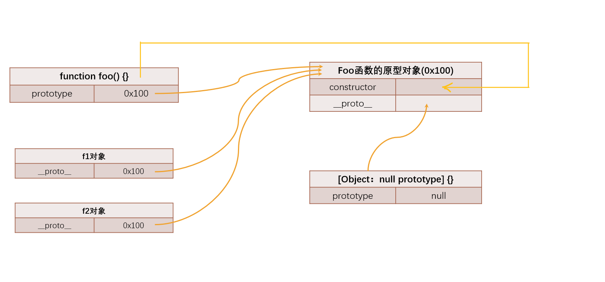
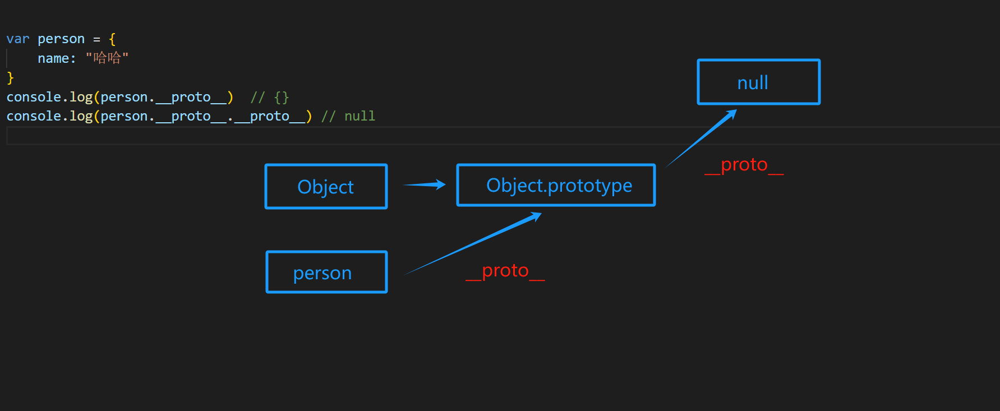

# 原型和原型链
## 认识对象的原型  
JS中每个对象都有一个特殊的内置属性prototype，这个特殊的对象可以指向另一个对象  
### 原型的概念和如何查看原型
早期没有规范如何查看prototype，为了方便查看可以这样查看：  
``` js
var obj = {
    name: '哈哈'
}
console.log(obj.__proto__)   // {}
```
后来ES5提供了Object.getPrototypeOf(对象)方法，来查看prototype   
``` js
var obj = {
    name: '哈哈'
}
Object.getPrototypeOf(obj)   // {}
```
> 总结：每个对象都有一个prototype属性，这个属性可以称之为对象的原型(隐式原型)  

### 原型的作用
当我们从一个对象中获取某一个属性时，它会触发get操作  
触发get时会有两步操作：  
1. 在当前对象中查找对应属性，如果找到直接使用  
2. 如果没有找到，会沿着它的原型链去查找(也就是去prototype上查找)

```js
var obj = {
    name: '哈哈'
}
console.log(obj.age) // undefined
obj.__proto__.age = 18
console.log(obj.age) //  18
```
> 其作用是为了方便继承  

## 认识函数的原型  
函数也是个对象，它作为对象来说，它也是有[ prototype ]属性的(隐式原型)
``` js
function foo () {
    
}
console.log(foo.__proto__)  // {} 隐式原型
```
函数它因为是一个函数，所以它还会多出一个显式原型属性：prototype  
``` js
function foo () {
    
}
console.log(foo.prototype)  // {} 显式原型
```
> 注意：`foo.__proto__`和`foo.prototype`并不相同  

再回顾一下，new关键字的具体操作：
1. 在内存中创建一个新对象(空对象)  
2. 这个对象内部的__proto__ 属性会被赋值为构造函数的prototype属性  
3. 构造函数的内部this，指向创建出来的新对象  
4. 执行构造函数内部代码  
5. 如果构造函数中没有写返回值，则默认返回创建出来的新对象  

仔细看第二条
``` js

function foo(){
// 当new foo()时，创建了一个空对象
// 假设有一个空对象
var newObj = {}
// 对象内部的【 prototype 】属性会被被赋值为构造函数的prototype属性
newObj.__proto__ = foo.prototype
// 
}
new foo()
```
所以  
``` js
function foo(){

}
var f1 = new foo()
var f2 = new foo()

console.log(f1.__proto__ === foo.prototype) // true
console.log(f2.__proto__ === foo.prototype) // true
```

### 函数原型上的属性
函数原型对象中默认会有一个constructor属性,该属性指向函数本身
```js
function foo (){

}
console.log("函数原型",foo.prototype); // 显示空对象{}
console.log(foo.prototype.constructor); // 函数原型的constructor
```
## 原型链
每个对象都会拥有__proto__属性，称为原型，该原型是一个对象，那么原型对象也会拥有__proto__属性，所以这一层一层的关系称之为原型链。  
### 顶层原型Object
当我们从一个对象中获取某一个属性时，它会触发get操作  
触发get时会有两步操作：  
1. 在当前对象中查找对应属性，如果找到直接使用  
2. 如果没有找到，会沿着它的原型链去查找(也就是去prototype上查找)  

所以原型链的顶层原型是什么？
顶层原型是Object对象，该对象有原型属性，但是它的原型属性为null  


那么对应构造函数呢？  
``` js
function Person(name,age){
    this.name = name;
    this.age = age;
    Person.prototype.running = function(){
        console.log(this.name +"在奔跑")
    }
}
var person = new Person()

console.log(person.__proto__)  // { running: [Function (anonymous)] }
console.log(person.__proto__.__proto__) // [Object: null prototype] {}
console.log(person.__proto__.__proto__.__proto__) // null
```
