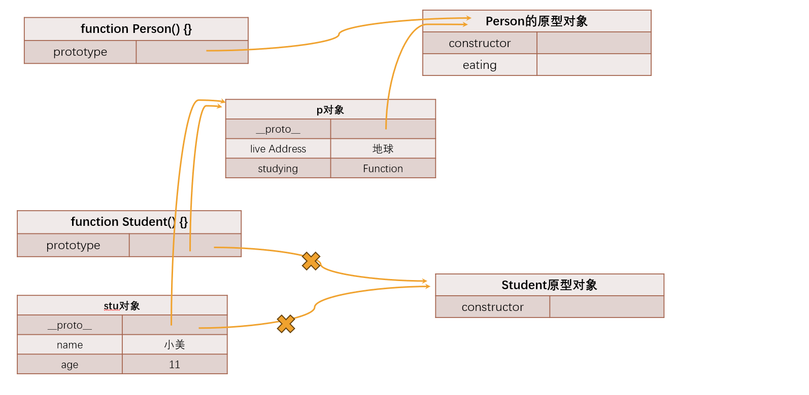

# 面向对象中的继承
## 原型链实现继承
``` js
// 父类：公共的属性和方法
function Person(){
    this.liveAddress = "地球"
}
Person.prototype.eating = function (){
    console.log(this.name + "在吃饭")
}
// 子类：特殊的属性和方法
function Student(name,age){
    this.name = name
    this.age = age
}
// 添加下面这行代码，进行继承
var p = new Person()
Student.prototype = p

Student.prototype.studying = function (){
    console.log(this.name + "在学习")
}

var stu = new Student("小美",11)
console.log(stu.liveAddress) // 会顺着原型链向上查找
stu.eating() // 会顺着原型链向上查找
```

**原型链实现继承的弊端**  
1. 打印stu对象，只会显示`{ name: '小美', age: 11 }`,不会显示全部属性  
2. 创建两个stu对象，获取引用类型的属性，修改引用类型的属性的值，会相互影响  

## 借用构造函数实现继承
``` js
// 父类：公共的属性和方法
function Person(name,age){
    this.name = name
    this.age = age
    this.liveAddress = "地球"
}
Person.prototype.eating = function (){
    console.log(this.name + "在吃饭")
}
// 子类：特殊的属性和方法
function Student(name,age){
    // 绑定Person函数中的this指向student,然后执行Person
    Person.call(this,name,age)
    this.identity = "student"
}
var p = new Person()
Student.prototype = p

Student.prototype.studying = function (){
    console.log(this.name + "在学习")
}

var stu = new Student("小美",11)
console.log(stu) 
// { name: '小美', age: 11, liveAddress: '地球', identity: 'student' }
```
在子类型构造函数的内部调用父类型构造函数,通过apply()和call()方法改变Person函数中this的指向
**借用构造函数实现继承的弊端：**  
1. Person函数至少会被调用两次  
2. stu的原型对象上会多出一些属性，但这些属性没有存在必要  
## 父类原型赋值给子类
## 原型式继承
## 寄生式继承
## 寄生组合式继承
## 原型判断方法补充
### hasOwnProperty
对象是否有某一个属于自己的属性（不是在原型上的属性）  
``` js
var obj ={
    name:"hahah",
    age: 19
}
var info = Object.create(obj,{
    address: {
        value: "北京",
        enumerable: true
    }
})
console.log(info.hasOwnProperty("address")) // true
console.log(info.hasOwnProperty("name")) // false
```
### in 操作符和for in操作
判断某个属性是否在(不管是属于对象本身还是属于原型)
``` js
var obj ={
    name:"hahah",
    age: 19
}
var info = Object.create(obj,{
    address: {
        value: "北京",
        enumerable: true
    }
})
for (const key in info) {
    console.log(info[key])
}
// 北京
// hahah
// 19
console.log("address" in info) // true
console.log("name" in info) // true
```
(未完待续.....)