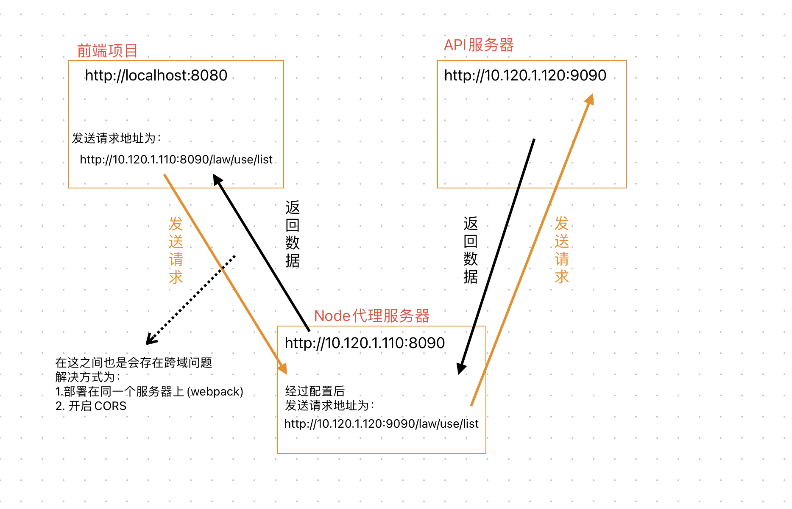
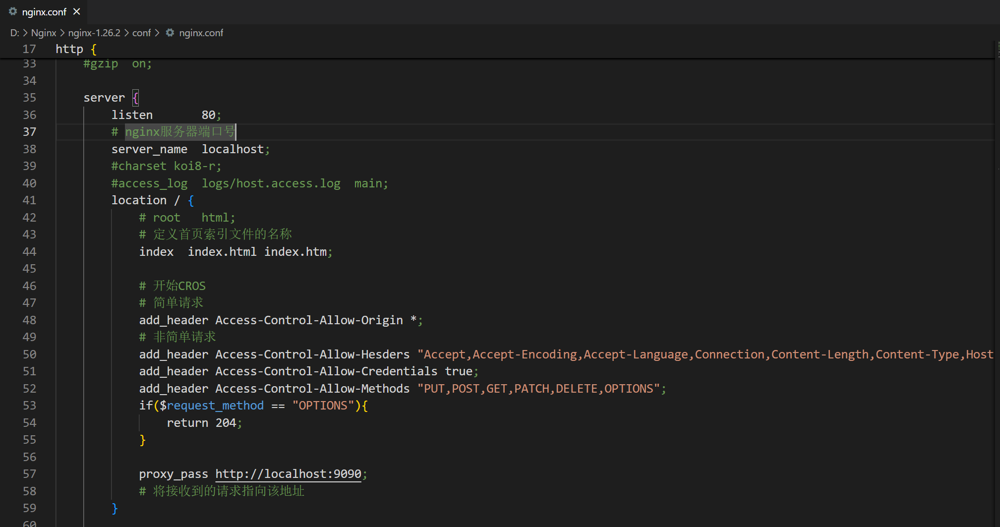

# 跨域  
## 什么是跨域？  
### 同源策略  
它是一个重要的安全策略，它用于限制一个源的文档或它加载的脚本，如何能与另一个源的资源交互，它能阻隔恶意文档，减少可能被攻击的媒介。  
### 什么样的URL称之为同源  
URL中协议，主机，端口号，都相同的称之为同源  
例如：  
`http://www.test.com:9090`和`http://www.test.com:9091`,端口号不同，所以不同源  
`https://www.test.com:9090`和`http://www.test.com:9090`,协议不同，所以不同源
### 跨域的产生  
因为随着前后端分离的发展，前端开发的代码和服务器开发的API接口往往是分离的，甚至部署在不同的服务器上。  
当浏览器发现静态资源和API接口请求不是来自于同一个地方时，就会因为同源策略产生了跨域。  
## 解决跨域的常见方案  
### 部署在相同服务器中
将静态资源和API服务器部署在同一个服务器中  
### CORS跨域资源共享  
跨域资源共享(CORS)，它是一种基于http header的机制。  
该机制通过允许**服务器标示**除了它自己以外的其他源(域,协议,端口号)  
使浏览器允许**已标记出来的源**访问，加载自己的资源  
**浏览器将CORS请求分为两类：简单请求和非简单请求**  
满足以下两大条件，就属于简单请求(不满足的就属于非简单请求)
1. 请求方法是以下三种之一：HEAD,GET,POST
2. HTTP头部信息不超出以下字段
 Accept
 Accept-Language
 Content-Language
 Last-Event-ID
 Content-Type：只限于三个值 application/x-www-form-urlencoded、multipart/form-data、text/plain

``` js
// 对于简单请求的解决代码
// 服务器中间件
app.use(async (ctx,next)=>{
    ctx.set("Access-Control-Allow-Origin","http://127.0.0.1:5500")
    // 只允许127.0.0.1:5500访问  
    // 或
    ctx.set("Access-Control-Allow-Origin","*")
    // 允许所有地址访问  
    await next()
})
```
``` js
// 对于非简单请求的解决代码
// 服务器中间件
app.use(async (ctx,next)=>{
    ctx.set("Access-Control-Allow-Origin","*")
    ctx.set("Access-Control-Allow-Hesders","Accept,Accept-Encoding,Accept-Language,Connection,Content-Length,Content-Type,Host,Origin,Referer,User-Agent")
    // 除了简单Header的信息，额外允许哪些头部字段  
    ctx.set("Access-Control-Allow-Credentials",true)
    // 允许携带凭证(cookie)
    ctx.set("Access-Control-Allow-Methods","PUT,POST,GET,PATCH,DELETE,OPTIONS")
    // 发送的请求都允许那些方式
    if(ctx.method == "OPTIONS"){
        ctx.body = 204
    }else {
        await next()
    }
    next()
})
```
### node代理服务器  
Node代理服务器是平时开发中前端配置最多的一种方案  
  
一般在开发中，使用webpack中devServer的proxy配置 ，这样前端项目和node代理服务器为同一个服务器了，所以就没有了跨域的问题   
``` js
const target = [
    '10.120.1.120:9090'
];
let proxy = {}
for (let i = 0; i < target.length; i++) {
    let pathRewrite = {};
    pathRewrite['^/' + target[i] + '/law/'] = '/law/';
    proxy['/' + target[i]] = {
        timeout: 1920000,
        target: 'http://' + target[i], // target表示代理的服务器url
        pathRewrite
    }
}
// proxy = {
//     '/10.120.1.120:9090': {
//     timeout: 1920000,
//     target: 'http://10.120.1.120:9090',
//     pathRewrite: { '^/10.120.1.120:9090/law/': '' }
//   }
// }

module.exports = {
  //...
  devServer: {
    proxy
  },
};
```
### Nginx反向代理
